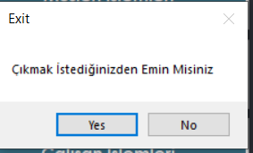

# Veri Tabanı ve Yönetim Sistemleri

# OTOPARK OTOMASYON SİSTEMİ (C/#)
_İbrahim Demirci_

## Kullanılan Teknolojiler:
-   C/# Forms
-   MSSQL Server

### Araç İşlemleri Menüsü<hr/>

>

>Bu menüde kayıtlı araçları gösterme, sisteme araç ekleme, kayıtlı bir
aracı güncelleme, silme ve araçlar içerisinde istenen özelliğe göre
arama yapma işlemleri yapılabilmektedir.

>**Araçları Göster Butonu** : Sistemdeki araçları görüntülemek için
kullanılacak buton.\
>**Araç Ekle Butonu :** Sisteme araç eklemek için kullanılacak buton.\
>**Araç Güncelle Butonu** : Seçilmiş olan aracı güncellemek için
kullanılacak buton.\
>**Araç Sil Butonu** : Seçilmiş aracı silmek için kullanılacak buton.
>**Ara Butonu** : Arama türü ve aranacak değer ile sistemde arama yapmak
için kullanılacak buton.\
>**Ana Menü Butonu** : Bir önceki menüye dönmek için basılacak buton.


### Müşteri İşlemleri Menüsü<hr/>
 

>Bu menüde kayıtlı müşterileri gösterme, sisteme müşteri ekleme,
kayıtlı bir müşteriyi güncelleme, silme ve müşteriler içerisinde istenen
özelliğe göre arama yapma işlemleri yapılabilmektedir.

>**Müşterileri Göster Butonu** : Sistemdeki müşterileri görüntülemek için
kullanılacak buton.\
>**Müşteri Ekleme Butonu** : Sisteme müşteri eklemek için kullanılacak
buton.\
>**Müşteri Güncelleme Butonu** : Seçilmiş olan müşteriyi güncellemek için
kullanılacak buton.\
>**Müşteri Sil Butonu** : Seçilmiş müşteriyi silmek için kullanılacak
buton.\
>**Müşteri Telefon Giriş Butonu** : Müşteri telefon numarasını eklemek için
kullanılacak buton.\
>**Ara Butonu** : Arama türü ve aranacak değer ile sistemde arama yapmak
için kullanılacak buton.\
>**Ana Menü Butonu** : Bir önceki menüye dönmek için basılacak buton.\

### Abonelik İşlemleri Menüsü<hr/>

>

>Bu menüde kayıtlı abonelikleri gösterme, sisteme abonelik ekleme,
kayıtlı bir abonelik güncelleme, silme ve abonelik süresi azalanları
görüntüleme işlemleri yapılabilmektedir.

>**Abonelikleri Göster Butonu** : Sistemdeki abonelikleri görüntülemek için
kullanılacak buton.\
>**Abonelik Ekleme Butonu** : Sisteme abonelik eklemek için kullanılacak
buton.\
>**Abonelik Güncelleme Butonu** : Seçilmiş olan aboneliği güncellemek için
kullanılacak buton.\
>**Abonelik Sil Butonu** : Seçilmiş aboneliği silmek için kullanılacak
buton.\
>**Abonelik Süresi Azalanlar Butonu** : Sistemdeki abonelik süresi azanları
göstermek için kullanılacak buton.\

>**Kayıtlı Araçları Göster Butonu** : Sistemdeki kayıtlı araç plakalarını
görmek için kullanılacak buton. Abonelik ekleme işleminde yardımcı olmak
için koyuldu.\
>
>**Ana Menü Butonu** : Bir önceki menüye dönmek için basılacak buton.

### Çalışan İşlemleri Menüsü <hr/>

>

>**Bu menüde kayıtlı çalışanları gösterme, sisteme çalışan kaydetme,
kayıtlı bir çalışan güncelleme, silme ve** **çalışanlar içerisinde
istenen özelliğe göre arama yapma işlemleri yapılabilmektedir..\
>**Çalışanları göster butonu: Sistemdeki çalışanları görüntülemek için
kullanılacak buton.\
>**Çalışan kaydet butonu: Sisteme çalışanı kaydetmek için kullanılacak
buton.\
>**Çalışan güncelleme butonu: Seçilmiş olan çalışanı güncellemek için
kullanılacak buton.\
>**Çalışan sil butonu: Seçilmiş çalışanı silmek için kullanılacak
buton.\
>**Ara butonu: Arama türü ve aranacak değer ile sistemde arama yapmak
için kullanılacak buton.\
>**Ana menü butonu** : Bir önceki menüye dönmek için basılacak buton.

### Müşteri Telefon İşlemleri Menüsü<hr/>

>
>Bu menüde telefon numaralarını gösterme, sisteme telefon ekleme,
kayıtlı bir telefon güncelleme ve silme işlemleri yapılabilmektedir.\

>**Telefon numaralarını göster butonu** : Sistemdeki telefon numaralarını
görüntülemek için kullanılacak buton.\

>**Telefon ekle butonu** : Sisteme telefon eklemek için kullanılacak
buton.\
>**Telefon sil butonu** : Seçilmiş olan telefonu silmek için kullanılacak
buton.\
>**Telefon güncelle butonu** : Seçilmiş olan telefonu güncellemek için
kullanılacak buton.\
>**Kapatma butonu** : müşteri telefon işlemleri menüsünü kapatmak için
basılacak buton.\
>**_Sistem Hatayı Minimuma İndirgeyecek Şekilde Tasarlanmıştır_
>**Yanlış bir işleme yol açabilecek her durum göz önüne alınmış ve uyarı
mesajları ile bilgilendirme yapılmıştır.\

### Örnek: <br/>

>**Primary Key değerlerin tekrar girilmesi durumu uyarısı.**
>   

>**Foreign Key değerlerin ana tabloda bulunamaması durumu uyarısı.**
>   <br/>
>   <br/>
>   <br/>
>   <br/>
>   <br/>
>   <br/>
>   <br/>

### ER Diyagram**<hr/>
>

###Veritabanı Şeması<hr/>
>

###Normalizasyon Aşamaları<hr/>


**Yukarıdaki şekilde görülen tabloyu her araç için yazdığımızda
görülüyor ki müşteri bilgilerini de her seferinde tutmamız gerekiyor. Bu
tabloyu 1NF yapmak için**

-   **"İlişkili veri gruplarına ait ayrı tablolar oluşturulmalı"**

> **Kuralını uygulandı ve iki ayrı tablo yaptım ve AracPlaka ve
> MusteriTc niteliklerini birincil anahtar uygulandı.**
>
> **Abonelik ve Arac tabloları da ayrı bir şekilde tutuluyor. Örneğin
> bir araç sisteme kayıtlı olabilir ama aboneliği henüz girilmemiş
> olabilir.**
>
> **MusteriTel ve Musteri tablolarının ayrılma sebebi ise bir müşterinin
> birden fazla telefona sahip olması durumunda tekrar eden verilerin
> olmasıdır.**
>
> 

**2NF için :**

-   **"KISMİ BAĞIMLILIKLAR KALDIRILMALIDIR."**

> **Kuralı neticesinde bakarsak tablomuzda herhangi bir kısmi bağımlılık
> bulunmuyor. Her alan tek bir anahtar alana bağlı.**

**3NF için :**

**Tabloya bakıldığında genelinde Geçişken bağımlılık da söz konusu
değildir. Dolayısıyla herhangi bir işleme gerek duymuyoruz.**

**Kurulan sistem 5 adet tablo içermektedir. Bunlar Arac, Musteri,
MusteriTel, Calisan ve Abonelik tablolarıdır.**

**Musteri.MusteriTc MusteriTel.MusteriTc arasında ilişki vardır ve
CASCADE yapıdadır. Yani Üst tablo yani Müşterilerden biri silinirse
telefon numarası var ise o da otomatik olarak silinir.**

**Arac.MusteriTc Musteri.MusteriTc arasında ilişki vardır ve CASCADE
yapıdadır. Yani Üst tablo yani Müşterilerden biri silinirse araç da
silinir çünkü sistemde sahipsiz bir araç olması yanlış bir durumdur.**

**Arac.AracPlaka Abonelik.AracPlaka arasında ilişki vardır ve CASCADE
yapıdadır. Yani Üst tablo yani Araçlardan biri silinirse araca ait
abonelik de silinir.**

**Arac: Otomasyonda araç bilgilerinin tutulduğu tablodur.**

-   **AracID : Identity özelliktedir. Dışarıdan veri girişine
    kapalıdır.**

-   **AracPlaka : varchar(9) türündedir. Primary key olarak
    atanmıştır.**

-   **AracMarka : varchar(20) türündedir.**

-   **AracModel : varchar(30) türündedir.**

-   **AracYil : smallint türündedir.**

-   **AracRenk : varchar(20) türündedir.**

-   **MusteriTc : char(11) türündedir. (Arac ve Musteri tabloları
    arasında Foreign Key olarak kullanılıyor.)**

**Musteri: Otomasyonda müşteri bilgilerinin tutulduğu tablodur.**

-   **MusteriID : Identity özelliktedir. Dışarıdan veri girişine
    kapalıdır.**

-   **MusteriTc : varchar(11) türündedir. Primary key olarak
    atanmıştır.**

-   **MusteriAd : varchar(30) türündedir.**

-   **MusteriSoyad: varchar(30) türündedir.**

**MusteriTel: Otomasyonda müşteri telefon bilgilerinin tutulduğu
tablodur.**

-   **MusteriTc : varchar(11) türündedir. (MusteriTel ve Musteri
    tabloları arasında Foreign Key olarak kullanılıyor.)**

-   **MusteriTel : varchar(11) türündedir. Primary key olarak
    atanmıştır. (Boş geçilmemeli ve eşsiz olmalıdır birden fazla aynı
    numara olamaz.)**

**Abonelik: Otomasyonda araçların abonelik bilgilerinin tutulduğu
tablodur.**

-   **AracPlaka : varchar(9) türündedir. Primary key olarak atanmıştır.
    . (Arac ve Abonelik tabloları arasında Foreign Key olarak
    kullanılıyor.)**

```{=html}
<!-- -->
```
-   **AbonelikBaslangic : date türündedir.**

-   **AbonelikBitis : date türündedir.**

**Calisan: Otomasyonda müşteri bilgilerinin tutulduğu tablodur.**

-   **MusteriID : Identity özelliktedir ve int türündedir. Dışarıdan
    veri girişine kapalıdır.**

-   **CalisanTc : varchar(11) türündedir. Primary key olarak
    atanmıştır.**

-   **CalisanAd : varchar(30) türündedir.**

-   **CalisanSoyad: varchar(30) türündedir.**

-   **CalisanMaas : smallint türündedir.**

-   **CalisanYas : tinyint türündedir.**

-   **MesaiTur : varchar(20) türündedir.**

**Örnek SQL Sorguları**

**2 TABLODA JOIN İŞLEMİ (Musteri-MusteriTel)**


**TARİH İŞLEMLERİ**


**3 TABLODA BİRDEN JOIN İŞLEMİ (Arac-Abonelik-Musteri)**


